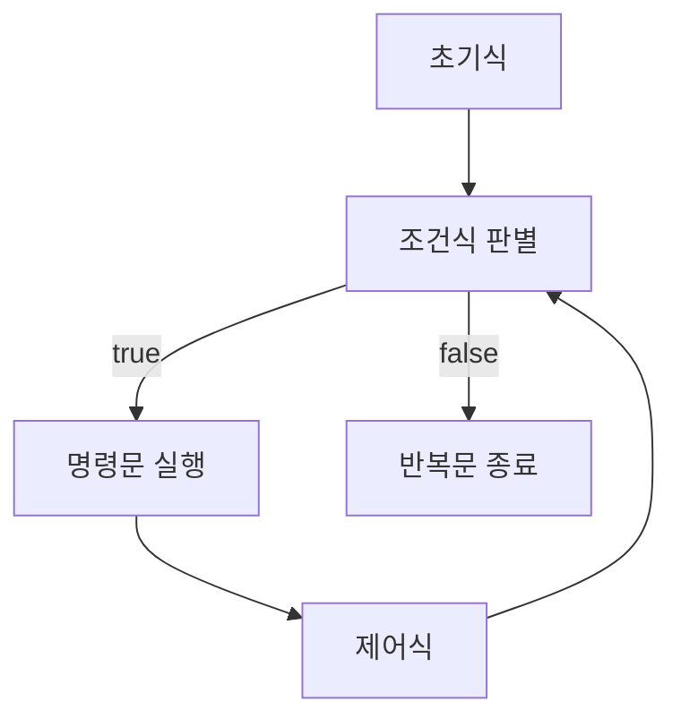

# 반복문

반복문은 특정 명령문을 반복하는 제어문이다. 주어진 조건에 따라 반복 실행 여부를 결정한다.

## for 문

for 문은 초기식, 조건식, 제어식, 명령문으로 구성된다. 조건식이 true일 때 반복 실행된다. 실행 순서는 다음과 같다.



1. 초기식이 먼저 실행된다.
2. 조건식이 참이면 명령문이 실행되고, 거짓이면 반복문을 종료한다.
3. 명령문이 실행된 후 제어식을 실행하여 조건식으로 돌아간다.

break와 continue 키워드를 사용하여 반복문을 제어할 수 있다.

```
for (init ; condition ; control) {
    // code;
}
```

## while 문

while 문은 조건식과 명령문으로 구성된다. 조건식이 참인 동안 계속해서 명령문을 반복 실행한다. 반복이 시작되기 전 조건식을 판별하며, for 문으로 대체가 가능하다.

```
while (조건식) {
    // 조건이 참일 때 실행될 코드
}
```

## do-while 문

do-while 문은 명령문을 먼저 실행한 후, 조건식을 판별한다. 명령문이 최소 한 번은 실행된다는 점에서 일반적인 while 문과 차이가 있다.

```do {
    // 명령문 실행
} while (조건식);
```

## foreach 문

foreach 문은 C 언어에서는 지원되지 않지만, 다른 프로그래밍 언어들에서는 주로 컬렉션이나 배열을 순회할 때 사용된다. for 문보다 간결하며, 모든 요소에 대해 반복적으로 접근할 수 있는 방식으로 사용된다.
