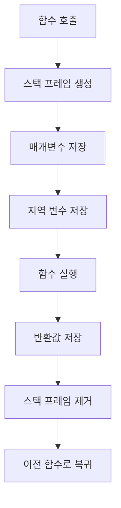

# 함수

함수는 **특정 기능을 수행하는 명령문 블록**으로, 코드의 재사용성을 높이고 프로그램을 구조적으로 작성할 수 있게 해준다. C 언어에서 함수는 반환 타입, 함수 이름, 인자의 타입 및 인자 이름을 포함한 토큰으로 구성된다.

---

## 함수의 기본 구조

함수는 다음과 같은 구성 요소로 이루어진다:

- **RET_TYPE**: 반환 타입
- **FUNC_NAME**: 함수 이름
- **ARG_TYPE**: 인자의 타입
- **arg**: 인자의 이름

다음은 함수의 기본 예시이다:

```c
int add(int a, int b) {   // int: RET_TYPE, add: FUNC_NAME, int a, int b: ARG_TYPE 및 arg
    return a + b;         // 두 정수를 더한 결과 반환
}
```

## 함수 선언과 정의

C 언어에서 함수는 **선언**과 **정의**를 분리할 수 있다. 함수 선언은 **함수의 인터페이스**만을 알리고, 정의는 실제 **구현**을 포함한다. 선언과 정의는 **순서**가 중요하다. 함수가 사용되기 전에 선언되어야 한다.

```c
// 함수 선언
int add(int a, int b);  // 함수가 사용되기 전에 선언

int main() {
    int result = add(3, 5);  // 함수 호출
    printf("%d\n", result);
    return 0;
}

// 함수 정의
int add(int a, int b) {
    return a + b;
}
```

### 헤더 파일의 사용

함수의 선언 순서를 지키는 것이 번거로울 경우, **헤더 파일**을 사용할 수 있다. 헤더 파일은 함수 선언을 별도의 파일에 저장하고, 여러 파일에서 공통적으로 사용할 수 있도록 한다. 헤더 파일은 파일의 상단에서 `#include` 지시어를 통해 포함시킬 수 있다.

예시: **myfunctions.h**

```c
// 함수 선언을 헤더 파일에 넣음
int add(int a, int b);
int subtract(int a, int b);
```

메인 파일에서 이를 사용:

```c
#include "myfunctions.h"

int main() {
    int sum = add(3, 5);
    int diff = subtract(10, 3);
    printf("Sum: %d, Difference: %d\n", sum, diff);
    return 0;
}
```

---

## 함수 인자: argument와 parameter

- **Parameter**: 함수가 정의될 때 사용하는 변수.
- **Argument**: 함수가 호출될 때 실제로 전달되는 값.

```c
// int a, int b는 parameter
int add(int a, int b) {
    return a + b;
}

// 함수 호출 시 3, 5는 argument
int result = add(3, 5);
```

### Call by Value와 Call by Address

- **Call by Value**: 인자의 값을 복사하여 함수로 전달하는 방식이다. 함수 내에서 값을 변경해도 원본 데이터는 변경되지 않는다.

```c
void modify(int a) {
    a = 10;  // 함수 내에서만 a의 값이 변경됨
}

int main() {
    int x = 5;
    modify(x);  // x의 값은 여전히 5
}
```

- **Call by Address**: 인자의 주소를 함수에 전달하는 방식으로, 함수 내에서 값의 변경이 실제 변수에 영향을 준다. 포인터를 사용하여 이를 구현한다.

```c
void modify(int *a) {
    *a = 10;  // 실제 변수의 값이 변경됨
}

int main() {
    int x = 5;
    modify(&x);  // x의 값이 10으로 변경됨
}
```

---

## 함수 호출과 스택 프레임

함수를 호출할 때, **스택 프레임**에 호출 정보가 저장된다. 각 함수 호출마다 새로운 스택 프레임이 생성되며, 함수가 종료되면 해당 스택 프레임은 제거된다. 재귀 함수 호출 시에는 함수가 계속해서 스택에 쌓이므로, **스택 오버플로우**에 주의해야 한다.



이 다이어그램은 함수 호출 시 스택 프레임의 구조를 보여준다. 매개변수와 지역 변수가 스택에 저장되고, 함수가 실행된 후 반환값을 저장한 뒤 스택 프레임이 제거된다.

---

## 재귀 함수와 스택 오버플로우

재귀 함수는 함수가 **자기 자신을 호출**하는 방식이다. 하지만 재귀 함수가 잘못 작성되거나 종료 조건이 없으면, 함수가 무한히 호출되어 **스택 오버플로우**가 발생할 수 있다. 스택 오버플로우는 스택이 가득 차서 더 이상 함수 호출을 처리할 수 없을 때 발생한다.

```c
// 잘못된 재귀 함수 예시 (종료 조건 없음)
void recurse() {
    recurse();  // 함수가 무한히 호출됨
}
```

---
