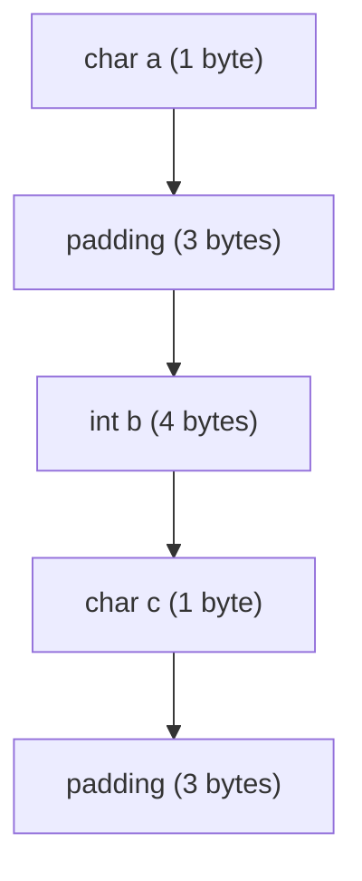

# 구조체 (Structure)

**구조체**는 C 언어에서 **여러 타입의 변수를 멤버로 가지는 사용자 정의 데이터 타입**이다. 구조체를 사용하면 서로 다른 타입의 데이터를 하나로 묶어서 처리할 수 있다. 이는 복잡한 데이터를 다룰 때 유용하며, 관련된 데이터를 그룹화하여 효율적으로 관리할 수 있다.

---

## 구조체 정의 및 사용

구조체는 `struct` 키워드를 사용하여 정의한다. **tag**를 이용하여 구조체에 이름을 붙일 수 있으며, **typedef**를 사용하면 구조체 타입을 재사용하기 쉽게 만들 수 있다.

```c
// 구조체 정의
struct Person {
    char name[50];
    int age;
    float height;
};

// typedef를 사용하여 구조체 재사용 용이하게 변경
typedef struct {
    char name[50];
    int age;
    float height;
} Person;

// 구조체 변수 선언 및 초기화
Person p1 = {"John Doe", 30, 180.5};
```

위의 코드에서, `struct Person`을 사용하여 구조체를 정의한 후, `Person`이라는 이름으로 재사용하기 위해 `typedef`를 사용했다. 이를 통해 `struct` 키워드를 생략하고 간결하게 구조체 변수를 선언할 수 있다.

---

## 구조체 연산자

구조체는 다음과 같은 **연산자**를 통해 다룰 수 있다:

1. **멤버 접근 연산자 (`.`)**: 구조체 변수를 통해 멤버에 접근할 때 사용한다.
   ```c
   printf("Name: %s\n", p1.name);  // p1의 name 멤버에 접근
   printf("Age: %d\n", p1.age);
   ```
2. **포인터 멤버 접근 연산자 (`->`)**: 구조체 포인터를 통해 멤버에 접근할 때 사용한다.
   ```c
   Person *ptr = &p1;
   printf("Name: %s\n", ptr->name);  // 포인터를 사용한 멤버 접근
   ```

---

### ? 구조체 연산자는 재정의가 불가능한가?

**구조체 연산자(`.` 및 `->`)**는 C 언어에서 **재정의가 불가능하다**. 이는 C 언어의 특성상 연산자 오버로딩 기능이 제공되지 않기 때문이다. 따라서 구조체에 대한 연산은 해당 연산자를 사용하여 접근해야 하며, 이 방식은 변경할 수 없다.

연산자 재정의는 C++에서 하자!

---

## 구조체의 인자 전달

구조체는 함수의 **인자로 전달**할 수 있다. 구조체를 함수에 전달할 때, **call by value** 방식이 기본적으로 사용된다. 즉, 구조체의 복사본이 함수에 전달되며, 함수 내에서 구조체 멤버 값을 변경해도 원본에는 영향을 미치지 않는다.

```c
void modifyPerson(Person p) {
    p.age = 40;  // 원본에는 영향을 주지 않음
}

int main() {
    Person p1 = {"Alice", 25, 165.5};
    modifyPerson(p1);
    printf("Age: %d\n", p1.age);  // 여전히 25
}
```

구조체는 **call by value**로 전달되며, 원본 데이터에 영향을 미치지 않는다. 하지만, 구조체 포인터를 함수에 전달하면 **call by reference**처럼 원본에 직접 접근할 수 있다.

```c
void modifyPersonByRef(Person *p) {
    p->age = 40;  // 원본을 수정
}

int main() {
    Person p1 = {"Alice", 25, 165.5};
    modifyPersonByRef(&p1);
    printf("Age: %d\n", p1.age);  // 40으로 수정됨
}
```

---

## 구조체의 메모리 저장 방식: Offset과 Padding

구조체가 메모리에 저장될 때, 각 멤버는 특정 **오프셋**에서 시작하며, **패딩(padding)**이 추가되어 각 멤버가 정렬된다. 구조체의 멤버는 컴파일러에 의해 메모리 상에서 **정렬**되며, 이 과정에서 메모리 접근 성능을 최적화하기 위해 **패딩**이 추가된다.

패딩은 멤버 간의 **메모리 정렬**을 맞추기 위해 필요한 공간이다. 예를 들어, 4바이트의 정수형 변수는 4바이트 경계에서 시작해야 하며, 이 과정에서 필요에 따라 패딩이 추가된다.

```c
struct Example {
    char a;   // 1바이트
    int b;    // 4바이트 (4바이트 경계에서 시작하기 위해 3바이트 패딩이 추가됨)
    char c;   // 1바이트 (4바이트 경계에서 시작)
};
```

패딩이 추가된 메모리 구조는 다음과 같다:



---

### ? Padding이 존재하는 이유는?

패딩은 **메모리 접근 성능을 최적화**하기 위해 존재한다. CPU는 특정 메모리 경계를 기준으로 데이터를 처리하는데, 이를 맞추지 않으면 성능이 저하될 수 있다. 따라서 멤버들이 올바르게 정렬되도록 패딩을 추가해, 빠르고 효율적인 메모리 접근을 보장한다.

---

### ? 정확한 크기를 알아내는 방법은?

패딩 때문에 `sizeof`를 사용하면 구조체의 정확한 크기를 얻기 어렵다고 생각할 수 있지만, 사실 **`sizeof` 연산자는 구조체의 실제 크기**를 반환한다. 즉, 패딩이 포함된 전체 구조체의 크기를 반환하므로, `sizeof`를 사용하면 정확한 메모리 크기를 알 수 있다.

```c
struct Example {
    char a;
    int b;
    char c;
};

int main() {
    printf("Size of Example: %lu\n", sizeof(struct Example));  // 패딩 포함 크기
    return 0;
}
```

위 코드에서 `sizeof(struct Example)`는 구조체의 전체 크기(패딩을 포함한 크기)를 반환한다.

---

# 구조체 요약

- **구조체**는 여러 타입의 변수를 하나의 단위로 묶을 수 있는 사용자 정의 데이터 타입이다.
- **연산자**로는 `.`(멤버 접근), `->`(포인터 멤버 접근)를 사용할 수 있으며, 이 연산자들은 **재정의 불가능**하다.
- **Call by value**로 구조체를 함수에 전달하면 복사본이 전달되며, **call by reference**(포인터 사용)로 전달하면 원본 데이터에 접근 가능하다.
- 구조체는 **메모리 정렬**을 위해 **패딩**을 포함해 저장되며, `sizeof` 연산자를 통해 정확한 크기를 알아낼 수 있다.
