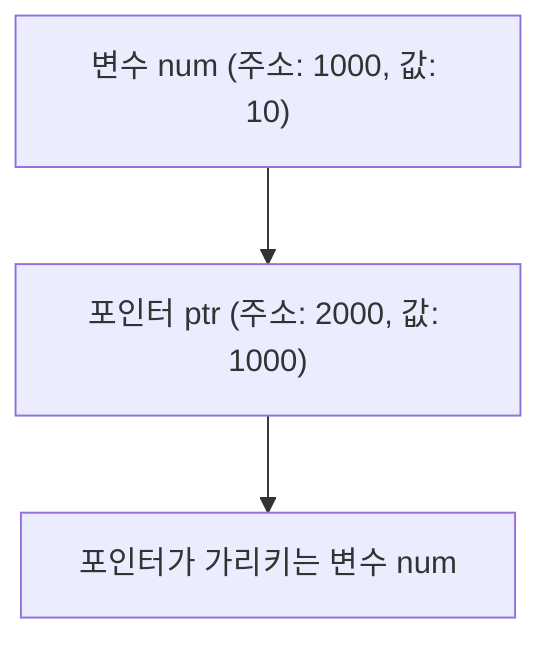

# 포인터 (Pointer)

**포인터**는 C 언어의 핵심 개념 중 하나로, **메모리 주소**를 저장하는 데이터 타입이다. C++에서도 사용되지만, 그 사용이 더 제한적이므로 포인터는 주로 **C 언어**에서 중요한 역할을 한다. 포인터를 이해하고 사용하면, 프로그램의 성능과 효율성을 높일 수 있으며, 메모리와 CPU의 동작 방식을 더 잘 이해할 수 있다.

---

## 포인터의 기본 개념

변수는 메모리에서 **값**이 저장된 위치(주소)에 저장되며, 변수 자체는 그 값을 참조한다. 반면, 포인터는 **값이 저장된 주소** 자체를 저장하며, 그 주소에 직접적으로 접근할 수 있게 해준다.

포인터는 담고 있는 데이터의 **타입**에 따라 그 종류가 결정되며, 선언 시 **`<type>*`** 형태로 사용된다.

```c
int a = 10;     // 정수 변수 a 선언
int* ptr = &a;  // a의 주소를 저장하는 포인터 선언
```

**`ptr`**은 `a` 변수의 메모리 주소를 가리킨다.

---

## 포인터의 사용 예시

포인터는 변수를 간접적으로 접근하고 값을 수정하는 데 사용된다.

```c
#include <stdio.h>

int main() {
    int num = 10;
    int* ptr = &num;  // num의 주소를 포인터에 저장

    printf("num의 값: %d\n", num);          // 10 출력
    printf("ptr이 가리키는 값: %d\n", *ptr); // 10 출력 (포인터를 역참조)

    *ptr = 20;  // 포인터를 사용해 num의 값을 수정
    printf("num의 새로운 값: %d\n", num);   // 20 출력

    return 0;
}
```

위 코드에서 `ptr`은 `num`의 주소를 가리키고, `*ptr`은 포인터가 가리키는 변수에 접근하여 값을 수정할 수 있다.

---

## 포인터의 메모리 구조

포인터는 메모리 상에서 변수가 저장된 주소를 가리키며, 이를 통해 변수에 간접적으로 접근할 수 있다.



- **num**은 값 10을 저장하고 있고, 주소는 1000이다.
- **ptr**은 **num**의 주소(1000)를 저장하고 있으며, 포인터가 가리키는 변수를 통해 num의 값에 접근할 수 있다.

---

## 포인터 연산자

포인터에는 다양한 연산자가 있으며, 이를 통해 포인터를 다룰 수 있다:

1. **주소 연산자 (`&`)**: 변수가 저장된 메모리 주소를 반환한다.

   ```c
   int a = 5;
   int* p = &a;  // 변수 a의 주소를 포인터 p에 저장
   ```

2. **간접 참조 연산자 (`*`)**: 포인터가 가리키는 메모리 주소에 저장된 값을 참조한다.

   ```c
   printf("%d\n", *p);  // p가 가리키는 변수 a의 값을 출력
   ```

3. **포인터 연산 (`+`, `-`)**: 포인터에 정수를 더하거나 빼면, 포인터가 가리키는 메모리 주소가 이동한다. 단위는 포인터의 type을 따라간다.

   ```c
   p++;  // 다음 메모리 주소로 이동 (데이터 타입에 따라 주소 크기 차이)
   ```

4. **배열 연산자 (`[]`)**: 포인터는 배열처럼 사용할 수 있다.

   ```c
   int arr[3] = {1, 2, 3};
   int* p = arr;
   printf("%d\n", p[1]);  // 2 출력 (배열의 두 번째 요소)
   ```

5. **포인터 멤버 접근 연산자 (`->`)**: 포인터로 구조체 멤버에 접근할 때 사용된다.

   ```c
   struct Person {
       char name[50];
       int age;
   };

   struct Person p1 = {"Alice", 25};
   struct Person* ptr = &p1;
   printf("%s\n", ptr->name);  // 포인터로 구조체 멤버 name에 접근
   ```

---

## `void` 포인터

`void` 포인터는 **범용 포인터**로, 모든 타입의 메모리 주소를 저장할 수 있다. 하지만, **데이터에 직접 접근하거나 연산을 수행할 수 없**으며, **타입 캐스팅**을 통해 사용할 수 있다. `void` 포인터는 주로 **함수 인자를 넘길 때** 사용된다.

```c
void printValue(void* ptr, char type) {
    if (type == 'i')
        printf("정수: %d\n", *(int*)ptr);  // int형으로 캐스팅
    else if (type == 'f')
        printf("실수: %f\n", *(float*)ptr);  // float형으로 캐스팅
}

int main() {
    int num = 10;
    float fnum = 3.14;

    printValue(&num, 'i');
    printValue(&fnum, 'f');

    return 0;
}
```

---

## 문자열을 나타내는 포인터

포인터는 **문자열**을 처리하는 데도 사용된다. C에서 문자열은 **문자 배열**로 표현되며, 포인터를 사용해 문자열의 첫 번째 문자의 주소를 가리킬 수 있다.

```c
char* str = "Hello, World!";
printf("%s\n", str);  // 문자열 출력
```

위의 코드는 문자열을 가리키는 **포인터**를 사용하여 문자열을 출력하는 예시이다. 문자열은 메모리 상에서 배열로 저장되므로, 포인터로 쉽게 처리할 수 있다.

---

### ? 포인터 인자를 실인자로 넘기는 방법

포인터를 함수의 **인자로 전달**할 때, 해당 포인터는 **call by reference** 방식으로 전달된다. 즉, 함수 내부에서 포인터를 통해 원래 변수를 직접 수정할 수 있다.

```c
void modifyValue(int* ptr) {
    *ptr = 20;  // 포인터를 통해 원래 변수의 값을 변경
}

int main() {
    int num = 10;
    modifyValue(&num);  // num의 주소를 함수에 전달
    printf("%d\n", num);  // num의 값이 20으로 변경됨

    return 0;
}
```

이 코드에서 `modifyValue` 함수는 `int*` 포인터를 통해 `num` 변수의 값을 직접 변경한다.

---

### 포인터 요약

- **포인터**는 **메모리 주소**를 저장하는 변수이며, 간접적으로 데이터를 처리할 수 있는 강력한 도구이다.
- 포인터는 **변수의 주소**를 저장하며, **간접 참조 연산자 (`*`)**를 통해 해당 주소에 있는 값에 접근할 수 있다.
- 다양한 **연산자**(`&`, `*`, `+`, `-`, `->`, `[]`)를 사용하여 포인터를 다룰 수 있다.
- **void 포인터**는 모든 타입의 주소를 저장할 수 있지만, 데이터 접근 시에는 **타입 캐스팅**이 필요하다.
- 포인터는 **문자열**과 **배열**을 처리하는 데 자주 사용되며, 함수에 포인터를 인자로 전달하면 **call by reference** 방식으로 처리된다.
